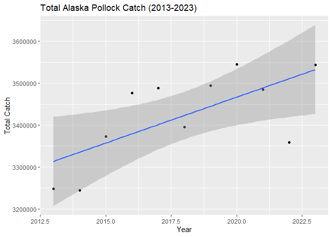

## Instructions
Answer the following questions and/or complete the exercises in RMarkdown. Please embed all of your code and push the final work to your repository. Your report should be organized, clean, and run free from errors. Remember, you must remove the `#` for any included code chunks to run.  

## Load the libraries

``` r
library("tidyverse")
library("janitor")
#library("naniar")
options(scipen = 999)
```

## About the Data
For this assignment we are going to work with a data set from the [United Nations Food and Agriculture Organization](https://www.fao.org/fishery/en/collection/capture) on world fisheries. These data were downloaded and cleaned using the `fisheries_clean.Rmd` script.  

Load the data `fisheries_clean.csv` as a new object titled `fisheries_clean`.

``` r
fisheries_clean <- read_csv("data/fisheries_clean.csv")
```

1. Explore the data. What are the names of the variables, what are the dimensions, are there any NA's, what are the classes of the variables, etc.? You may use the functions that you prefer.

``` r
names(fisheries_clean)
```

```
## [1] "period"          "continent"       "geo_region"      "country"        
## [5] "scientific_name" "common_name"     "taxonomic_code"  "catch"          
## [9] "status"
```


``` r
str(fisheries_clean)
```

```
## spc_tbl_ [1,055,015 × 9] (S3: spec_tbl_df/tbl_df/tbl/data.frame)
##  $ period         : num [1:1055015] 1950 1951 1952 1953 1954 ...
##  $ continent      : chr [1:1055015] "Asia" "Asia" "Asia" "Asia" ...
##  $ geo_region     : chr [1:1055015] "Southern Asia" "Southern Asia" "Southern Asia" "Southern Asia" ...
##  $ country        : chr [1:1055015] "Afghanistan" "Afghanistan" "Afghanistan" "Afghanistan" ...
##  $ scientific_name: chr [1:1055015] "Osteichthyes" "Osteichthyes" "Osteichthyes" "Osteichthyes" ...
##  $ common_name    : chr [1:1055015] "Freshwater fishes NEI" "Freshwater fishes NEI" "Freshwater fishes NEI" "Freshwater fishes NEI" ...
##  $ taxonomic_code : chr [1:1055015] "1990XXXXXXXX106" "1990XXXXXXXX106" "1990XXXXXXXX106" "1990XXXXXXXX106" ...
##  $ catch          : num [1:1055015] 100 100 100 100 100 200 200 200 200 200 ...
##  $ status         : chr [1:1055015] "A" "A" "A" "A" ...
##  - attr(*, "spec")=
##   .. cols(
##   ..   period = col_double(),
##   ..   continent = col_character(),
##   ..   geo_region = col_character(),
##   ..   country = col_character(),
##   ..   scientific_name = col_character(),
##   ..   common_name = col_character(),
##   ..   taxonomic_code = col_character(),
##   ..   catch = col_double(),
##   ..   status = col_character()
##   .. )
##  - attr(*, "problems")=<externalptr>
```


``` r
any(is.na(fisheries_clean))
```

```
## [1] TRUE
```

2. Convert the following variables to factors: `period`, `continent`, `geo_region`, `country`, `scientific_name`, `common_name`, `taxonomic_code`, and `status`.

``` r
fisheries_clean %>% 
  mutate(across(c(period, continent, geo_region, country, scientific_name, common_name, taxonomic_code, status), as.factor))
```

```
## # A tibble: 1,055,015 × 9
##    period continent geo_region    country     scientific_name common_name       
##    <fct>  <fct>     <fct>         <fct>       <fct>           <fct>             
##  1 1950   Asia      Southern Asia Afghanistan Osteichthyes    Freshwater fishes…
##  2 1951   Asia      Southern Asia Afghanistan Osteichthyes    Freshwater fishes…
##  3 1952   Asia      Southern Asia Afghanistan Osteichthyes    Freshwater fishes…
##  4 1953   Asia      Southern Asia Afghanistan Osteichthyes    Freshwater fishes…
##  5 1954   Asia      Southern Asia Afghanistan Osteichthyes    Freshwater fishes…
##  6 1955   Asia      Southern Asia Afghanistan Osteichthyes    Freshwater fishes…
##  7 1956   Asia      Southern Asia Afghanistan Osteichthyes    Freshwater fishes…
##  8 1957   Asia      Southern Asia Afghanistan Osteichthyes    Freshwater fishes…
##  9 1958   Asia      Southern Asia Afghanistan Osteichthyes    Freshwater fishes…
## 10 1959   Asia      Southern Asia Afghanistan Osteichthyes    Freshwater fishes…
## # ℹ 1,055,005 more rows
## # ℹ 3 more variables: taxonomic_code <fct>, catch <dbl>, status <fct>
```

##3. Are there any missing values in the data? If so, which variables contain missing values and how many are missing for each variable?


4. How many countries are represented in the data?

``` r
fisheries_clean %>% 
  summarize(num_country = n_distinct(country))
```

```
## # A tibble: 1 × 1
##   num_country
##         <int>
## 1         249
```

There are 249 countries represented in the data.

5. The variables `common_name` and `taxonomic_code` both refer to species. How many unique species are represented in the data based on each of these variables? Are the numbers the same or different?

``` r
fisheries_clean %>% 
  summarize(num_common_name = n_distinct(common_name), num_taxonomic_code = n_distinct(taxonomic_code))
```

```
## # A tibble: 1 × 2
##   num_common_name num_taxonomic_code
##             <int>              <int>
## 1            3390               3722
```

The numbers are slightly different between the number of species under 'common_name' and 'taxonomic_code'.

6. In 2023, what were the top five countries that had the highest overall catch?

``` r
fisheries_clean %>% 
  filter(period=="2023") %>% 
  group_by(country) %>% 
  summarize(overall_catch = sum(catch, na.rm = T)) %>% 
  arrange(desc(overall_catch)) %>% 
  slice_head(n = 5)
```

```
## # A tibble: 5 × 2
##   country                  overall_catch
##   <chr>                            <dbl>
## 1 China                        13424705.
## 2 Indonesia                     7820833.
## 3 India                         6177985.
## 4 Russian Federation            5398032 
## 5 United States of America      4623694
```

Top 5 countries that had the highest overall catch include China, Indonesia, India, Russian Federation, and the US.

7. In 2023, what were the top 10 most caught species? To keep things simple, assume `common_name` is sufficient to identify species. What does `NEI` stand for in some of the common names? How might this be concerning from a fisheries management perspective?

``` r
fisheries_clean %>% 
  filter(period=="2023") %>%
  group_by(common_name) %>% 
  summarize(overall_catch = sum(catch, na.rm = T)) %>% 
  arrange(desc(overall_catch)) %>% 
  slice_head(n = 10)
```

```
## # A tibble: 10 × 2
##    common_name                    overall_catch
##    <chr>                                  <dbl>
##  1 Marine fishes NEI                   8553907.
##  2 Freshwater fishes NEI               5880104.
##  3 Alaska pollock(=Walleye poll.)      3543411.
##  4 Skipjack tuna                       2954736.
##  5 Anchoveta(=Peruvian anchovy)        2415709.
##  6 Blue whiting(=Poutassou)            1739484.
##  7 Pacific sardine                     1678237.
##  8 Yellowfin tuna                      1601369.
##  9 Atlantic herring                    1432807.
## 10 Scads NEI                           1344190.
```

NEI stands for Not Elsewhere Included. It means that not all catches are identified to that specific species and rather grouped into a general category. From the fisheries management perspective, very specific population trends can't be analyzed due to this. Vulnerable species may go unnoticed if they are grouped with the more abundant species.

8. For the species that was caught the most above (not NEI), which country had the highest catch in 2023?

``` r
fisheries_clean %>% 
  filter(period=="2023", 
         common_name=="Alaska pollock(=Walleye poll.)") %>% 
  group_by(country) %>% 
  summarize(overall_catch = sum(catch, na.rm = T)) %>% 
  arrange(desc(overall_catch)) %>% 
  slice_head(n = 10)
```

```
## # A tibble: 6 × 2
##   country                               overall_catch
##   <chr>                                         <dbl>
## 1 Russian Federation                         1893924 
## 2 United States of America                   1433538 
## 3 Japan                                       122900 
## 4 Democratic People's Republic of Korea        58730 
## 5 Republic of Korea                            28432.
## 6 Canada                                        5887.
```

Excluding the NEI, the species that was caught the most was the Alaska pollock(=Walleye poll.). When only looking at this species, the Russian Federation had the highest catch. 

9. How has fishing of this species changed over the last decade (2013-2023)? Create a plot showing total catch by year for this species.

``` r
fisheries_clean %>% 
  filter(common_name == "Alaska pollock(=Walleye poll.)",
         period >= 2013, 
         period <= 2023) %>% 
  group_by(period) %>% 
  summarize(overall_catch = sum(catch, na.rm = T)) %>% 
  ggplot(aes(x = period, y = overall_catch))+
  geom_point()+
  geom_smooth(method="lm", se = TRUE)+
  labs(title = "Total Alaska Pollock Catch (2013-2023)", x = "Year", y = "Total Catch")
```

```
## `geom_smooth()` using formula = 'y ~ x'
```

<!-- -->

Overall, fishing for this specific species has increased in a decade.

10. Perform one exploratory analysis of your choice. Make sure to clearly state the question you are asking before writing any code.

Which countries have the greatest species diversity in their catches? List the top 10 countries.

``` r
fisheries_clean %>% 
  group_by(country) %>% 
  summarize(species = n_distinct(common_name)) %>% 
  arrange(desc(species)) %>% 
  slice_head(n=10)
```

```
## # A tibble: 10 × 2
##    country                                              species
##    <chr>                                                  <int>
##  1 Spain                                                    970
##  2 United States of America                                 763
##  3 Portugal                                                 621
##  4 Colombia                                                 564
##  5 France                                                   516
##  6 United Kingdom of Great Britain and Northern Ireland     378
##  7 Italy                                                    377
##  8 New Zealand                                              364
##  9 Russian Federation                                       354
## 10 Ecuador                                                  349
```

The country with the greatest species diversity in their catches is Spain, followed by the United States and Portugal.

## Knit and Upload
Please knit your work as an .html file and upload to Canvas. Homework is due before the start of the next lab. No late work is accepted. Make sure to use the formatting conventions of RMarkdown to make your report neat and clean!  
